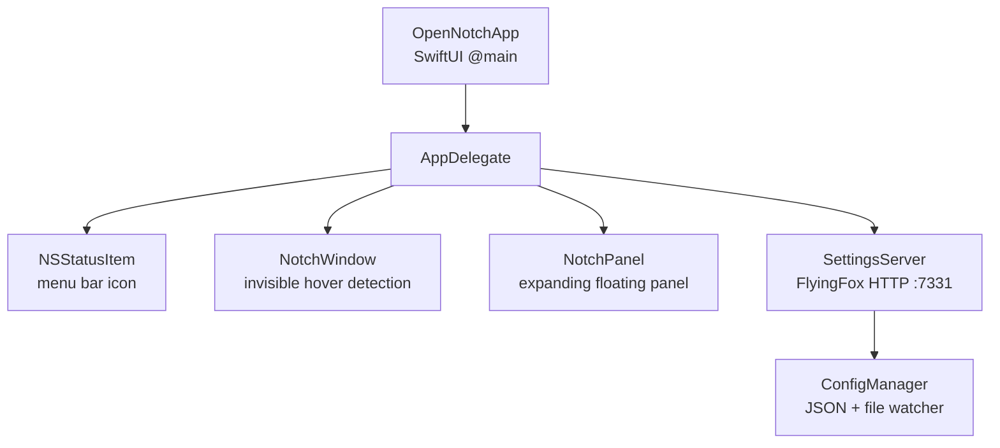

<h1 align="center">OpenNotch</h1>

<p align="center">
  <strong>A macOS menu bar app that turns your MacBook's notch into a configurable widget hub.</strong>
</p>

<p align="center">
  <a href="https://apple.com/macos"></a>
  <a href="https://swift.org"></a>
  <a href="https://opensource.org/licenses/MIT"></a>
  <a href="http://makeapullrequest.com"></a>
</p>

<p align="center">
  <em>Hover over the notch to reveal a floating panel with live widgets — currently playing music, upcoming calendar events, date/time, and more.</em>
</p>

<br/>

<!-- TODO: Add a nice screenshot or GIF of the app in action here -->
<!-- <p align="center"></p> -->

## ✨ Features

- **Notch integration** — hover over the MacBook notch to reveal the widget panel with a smooth spring animation
- **Configurable widgets** — Date & Time, Now Playing (Music.app / Spotify), Calendar events
- **Menu bar icon** — secondary entry point; left-click toggles the panel, right-click opens settings
- **Web-based settings** — configure widgets, appearance, and layout at `http://localhost:7331`
- **Hot-reload** — settings changes apply instantly without restarting
- **Auto-start** — installs as a login item via `launchd`

## 💻 Requirements

- **OS:** macOS 14.0+ (Sonoma)
- **Hardware:** MacBook with a notch (2021 MacBook Pro or later)
- **Build:** Xcode 15+

## 🚀 Installation

### Quick Install

```bash
git clone https://github.com/youruser/OpenNotch.git
cd OpenNotch
chmod +x install.sh
./install.sh
```

The install script will automatically:
1. Build the app with `xcodebuild`
2. Ad-hoc sign the binary (`codesign --deep --force --sign -`)
3. Copy `OpenNotch.app` to `/Applications`
4. Create a `launchd` plist for auto-start on login
5. Launch the app

### 🛠️ Manual Build

```bash
xcodebuild -project OpenNotch.xcodeproj -scheme OpenNotch -configuration Release build
```

## 🎮 Usage

| Action | Trigger |
|---|---|
| **Open panel** | Hover over the notch |
| **Close panel** | Move mouse away from the panel |
| **Toggle panel** | Click the menu bar icon or press `` ` `` (backtick) |
| **Open settings** | Right-click menu bar icon → **Settings**, or visit `http://localhost:7331` |
| **Quit** | Right-click menu bar icon → **Quit** |

## ⚙️ Settings

Open `http://localhost:7331` in any browser to configure:

- **Widgets** — toggle on/off, drag to reorder
- **Appearance** — accent color, font size, background opacity
- **Config file** — stored at `~/Library/Application Support/OpenNotch/config.json`

*Changes are saved automatically and applied instantly via hot-reload.*

## 🏗️ Architecture



## 📦 Dependencies

- [FlyingFox](https://github.com/swhitty/FlyingFox) — lightweight async HTTP server (via Swift Package Manager)

## 🧹 Uninstall

```bash
pkill -x OpenNotch
launchctl unload ~/Library/LaunchAgents/com.opennotch.app.plist
rm -rf /Applications/OpenNotch.app
rm ~/Library/LaunchAgents/com.opennotch.app.plist
rm -rf ~/Library/Application\ Support/OpenNotch

killall OpenNotch
xcodebuild -project OpenNotch.xcodeproj -scheme OpenNotch CODE_SIGN_IDENTITY="-" CODE_SIGN_STYLE="Manual"
open /Users/jitselambrichts/Library/Developer/Xcode/DerivedData/OpenNotch-bsxgnmezudeuhlauhylirrdlpkwh/Build/Products/Debug/OpenNotch.app
```

## 📄 License

This project is licensed under the [MIT License](LICENSE).